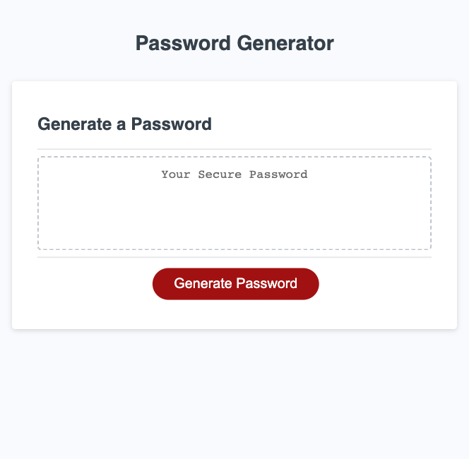

# wk3 - Password Generator

# Description
The purpose of this project is to use javascript to generate a random password based on user input and dynamically modiy the HTML shown on the webpage.

When the 'Generate Password' button is clicked the challenge is primarily fulfilled by using prompt(), alert(), and confirm() windows inside conditional statements; exploring ways to manipulate arrays, and organizing functions all built from the previous weeks of the bootcamp. 

When the website is opened (or when source code is opened in default browser), the following page should appear as shown in the image below.

## Installation

N/A

## Usage

Open the webpage using the [live URL link](https://chloeeh.github.io/hanks-password-gen/) and use Chrome Developer Tools to inspect the source code. The code is commented and includes accessibility tags compared to the original code that used generic division tags.

## Credits

Resources used:
1) Bootcamp Pre-work Modules
2) Bootcamp 03-Javascript > 01-Activities
3) [Filter Array Element](https://stackoverflow.com/questions/18518855/remove-all-items-in-array-that-start-with-a-particular-string)
4) [Understanding Nested Arrays](https://javascript.plainenglish.io/understanding-the-nested-arrays-fbf3ab13c2b4)
5) [Generating Random Substring of given length (Step 5)](https://dev.to/code_mystery/random-password-generator-using-javascript-6a)
6) Various stackoverflow forums (i.e. what prompt() and confirm() return when cancel is pressed)
7) various w3schools pages (i.e. do-while loop)

## License

Please refer to the LICENSE in the repository.